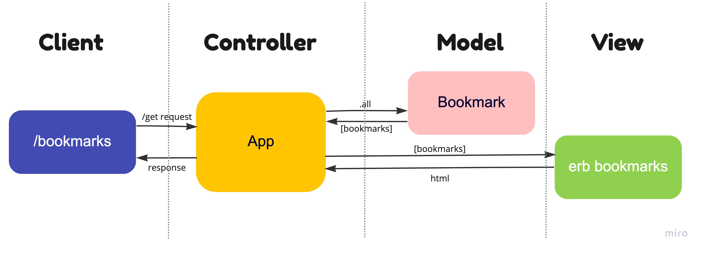

```
As a user
So that I can reach a website quickly
I would like to see a list of my bookmarks

```

```
As a user
So that I can remember a website
I would like to add a new bookmark to the list

```

```
As a user
So that I can forget a website
I would like to remove a bookmark from the list

```

```
As a user
So that I can change the name or details of a website
I would like to update the bookmarks list

```

```
As a user
So that I can organise my bookmarks
I would like to tag bookmarks into categories

```

```
As a user
So that I can see related bookmarks
I would like to filter bookmarks by tag

```

